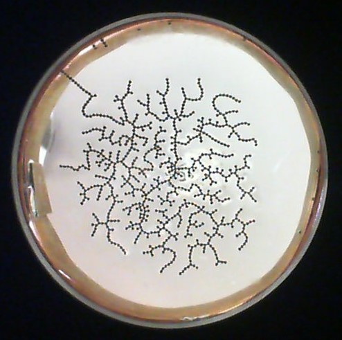
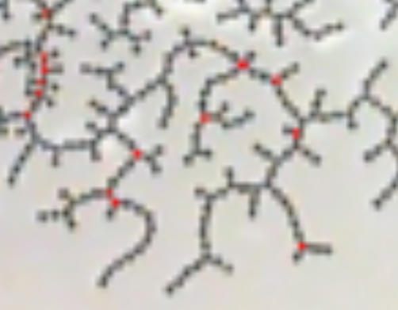

# Tarea #3 de Procesamiento de Imágenes UH

Autores:
- Carmen Irene Cabrera Rodríguez C512
- Victor Manuel Cardentey Fundora C511

## Descripción:

Utilización de filtros morfológicos en la detección de patrones en imágenes. Se utilizó la transformación *hit or miss* para
detectar bifurcaciones en un patrón dado.

La solución se encuentra en el archivo `hw3_hit_or_miss.ipynb`.

## Requisitos

> pip3 install -r requirements.txt
